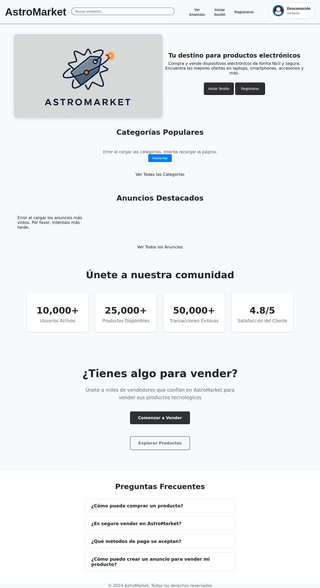

# 🌟 AstroMarket - Marketplace de Tecnología

<div align="center">
  
  
  **Tu marketplace de confianza para comprar y vender productos tecnológicos**
  
  [](https://choosealicense.com/licenses/mit/)
  [](https://nodejs.org/)
  [](https://expressjs.com/)
  [](https://www.mysql.com/)
</div>

## 📋 Tabla de Contenidos

- [Descripción](#-descripción)
- [Características](#-características)
- [Tecnologías](#-tecnologías)
- [Instalación](#-instalación)
- [Configuración](#-configuración)
- [Uso](#-uso)
- [Estructura del Proyecto](#-estructura-del-proyecto)
- [API Endpoints](#-api-endpoints)
- [Base de Datos](#-base-de-datos)
- [Capturas de Pantalla](#-capturas-de-pantalla)
- [Contribución](#-contribución)
- [Licencia](#-licencia)
- [Autor](#-autor)

## 🚀 Descripción

AstroMarket es un marketplace web completo desarrollado para la compra y venta de productos tecnológicos. La plataforma permite a los usuarios registrarse, publicar anuncios de productos, buscar y filtrar productos, comunicarse a través de un sistema de mensajería integrado, y gestionar sus anuncios y productos guardados.

### Funcionalidades Principales

- 🛍️ **Marketplace Completo**: Compra y venta de productos tecnológicos
- 👥 **Gestión de Usuarios**: Registro, autenticación y perfiles de usuario
- 💬 **Sistema de Mensajería**: Chat en tiempo real entre compradores y vendedores
- 🔍 **Búsqueda Avanzada**: Filtros por categoría, precio, ubicación y más
- 📱 **Responsive Design**: Optimizado para dispositivos móviles y desktop
- 🏷️ **Categorización**: Sistema organizado de categorías y subcategorías
- 📍 **Geolocalización**: Búsqueda por departamentos y ciudades
- ⭐ **Sistema de Guardados**: Los usuarios pueden guardar anuncios de interés

## ✨ Características

### Para Compradores
- Navegación por categorías de productos
- Búsqueda de productos con filtros avanzados
- Visualización detallada de productos con imágenes
- Sistema de mensajería directa con vendedores
- Gestión de anuncios guardados
- Historial de conversaciones

### Para Vendedores
- Panel de vendedor personalizado
- Creación y edición de anuncios
- Gestión de múltiples imágenes por producto
- Sistema de mensajería con compradores
- Control de visibilidad de anuncios
- Estadísticas de visualizaciones

### Características Técnicas
- Arquitectura MVC (Model-View-Controller)
- API RESTful para comunicación frontend-backend
- Long polling para mensajería en tiempo real
- Upload de imágenes con Multer
- Validación de datos en frontend y backend
- Diseño responsive con CSS Grid y Flexbox

## 🛠️ Tecnologías

### Backend
- **Node.js** - Entorno de ejecución de JavaScript
- **Express.js** - Framework web para Node.js
- **MySQL** - Base de datos relacional
- **Multer** - Middleware para upload de archivos
- **dotenv** - Gestión de variables de entorno

### Frontend
- **HTML5** - Estructura de la aplicación web
- **CSS3** - Estilos y diseño responsive
- **JavaScript (Vanilla)** - Lógica del frontend
- **Font Awesome** - Iconografía

### Base de Datos
- **MySQL 8.0+** - Sistema de gestión de base de datos

## 📦 Instalación

### Prerrequisitos

Asegúrate de tener instalado:
- [Node.js](https://nodejs.org/) (versión 16 o superior)
- [MySQL](https://www.mysql.com/) (versión 8.0 o superior)
- [Git](https://git-scm.com/)

### Pasos de Instalación

1. **Clonar el repositorio**
   ```bash
   git clone https://github.com/Mario-pereyra/Proyecto-final-Web.git
   cd Proyecto-final-Web
   ```

2. **Instalar dependencias**
   ```bash
   npm install
   ```

3. **Configurar la base de datos**
   ```bash
   # Conectarse a MySQL
   mysql -u root -p
   
   # Ejecutar el script de la base de datos
   source db/db_astroMarket.sql
   ```

4. **Configurar variables de entorno**
   ```bash
   # Crear archivo .env en la raíz del proyecto
   touch .env
   ```
   
   Agregar las siguientes variables al archivo `.env`:
   ```env
   PORT=3001
   DB_HOST=localhost
   DB_USER=root
   DB_PASSWORD=tu_password
   DB_NAME=db_AstroMarket
   ```

5. **Iniciar el servidor**
   ```bash
   npm start
   # o
   node index.js
   ```

6. **Acceder a la aplicación**
   
   Abrir el navegador en: http://localhost:3001

## ⚙️ Configuración

### Variables de Entorno

Crear un archivo `.env` en la raíz del proyecto con:

```env
# Puerto del servidor
PORT=3001

# Configuración de la base de datos
DB_HOST=localhost
DB_USER=root
DB_PASSWORD=tu_password_mysql
DB_NAME=db_AstroMarket
```

### Configuración de la Base de Datos

La base de datos se crea automáticamente ejecutando el script `db/db_astroMarket.sql`. Este script incluye:

- Creación de todas las tablas necesarias
- Relaciones entre tablas (Foreign Keys)
- Datos de prueba para categorías y ubicaciones

## 🎯 Uso

### Para Usuarios

1. **Registro**: Crear una cuenta nueva con email y contraseña
2. **Iniciar Sesión**: Acceder con credenciales registradas
3. **Explorar Productos**: Navegar por categorías o usar la búsqueda
4. **Ver Detalles**: Hacer clic en cualquier producto para ver información completa
5. **Contactar Vendedor**: Usar el sistema de mensajería integrado
6. **Guardar Anuncios**: Marcar productos de interés para revisión posterior

### Para Vendedores

1. **Acceder al Panel**: Ir a "Panel Vendedor" después de iniciar sesión
2. **Crear Anuncio**: Completar formulario con detalles del producto
3. **Subir Imágenes**: Agregar múltiples fotos del producto
4. **Gestionar Anuncios**: Editar, activar/desactivar o eliminar anuncios
5. **Responder Mensajes**: Comunicarse con compradores interesados

### Sistema de Mensajería

- **Chat en Tiempo Real**: Mensajería instantánea entre usuarios
- **Contexto del Producto**: Cada conversación está vinculada a un anuncio específico
- **Historial**: Todas las conversaciones se guardan automáticamente
- **Notificaciones**: Indicadores visuales para mensajes nuevos

## 📁 Estructura del Proyecto

```
Proyecto-final-Web/
├── 📁 controllers/          # Controladores de la aplicación
│   ├── anuncioController.js
│   ├── mensajeController.js
│   └── usuarioController.js
├── 📁 db/                   # Base de datos y scripts
│   ├── db_astroMarket.sql
│   ├── mysqlConecction.js
│   └── *.json              # Datos de prueba
├── 📁 public/               # Archivos públicos del frontend
│   ├── 📁 css/             # Estilos CSS
│   ├── 📁 js/              # Scripts JavaScript
│   ├── 📁 img/             # Imágenes estáticas
│   ├── 📁 pages/           # Páginas HTML
│   └── index.html          # Página principal
├── 📁 repositories/         # Capa de acceso a datos
│   ├── anuncioRepository.js
│   ├── mensajeRepository.js
│   └── usuarioRepository.js
├── 📁 routes/              # Definición de rutas API
│   ├── AnuncioRouter.js
│   ├── chatRouter.js
│   └── usuarioRouter.js
├── 📁 uploads/             # Archivos subidos por usuarios
├── .env                    # Variables de entorno
├── .gitignore             # Archivos excluidos de Git
├── index.js               # Archivo principal del servidor
├── package.json           # Configuración y dependencias
└── README.md              # Documentación del proyecto
```

## 🔌 API Endpoints

### Usuarios
```http
POST /api/usuario/registro     # Registro de nuevo usuario
POST /api/usuario/login        # Inicio de sesión
GET  /api/usuario/:id          # Obtener información del usuario
```

### Anuncios
```http
GET    /api/anuncios           # Listar todos los anuncios
GET    /api/anuncios/:id       # Obtener anuncio específico
POST   /api/anuncios           # Crear nuevo anuncio
PUT    /api/anuncios/:id       # Actualizar anuncio
DELETE /api/anuncios/:id       # Eliminar anuncio
```

### Categorías
```http
GET /api/categorias            # Listar categorías
GET /api/subcategorias         # Listar subcategorías
```

### Mensajería
```http
POST /api/chat/conversacion/iniciar           # Iniciar conversación
GET  /api/chat/conversaciones/usuario/:id     # Obtener conversaciones del usuario
GET  /api/chat/conversacion/:id/mensajes      # Obtener mensajes de conversación
POST /api/chat/mensajes                       # Enviar mensaje
GET  /api/chat/conversacion/:id/poll          # Long polling para mensajes nuevos
```

### Ubicaciones
```http
GET /api/departamentos         # Listar departamentos
GET /api/ciudades             # Listar ciudades
```

### Imágenes
```http
POST /api/imagenes/upload     # Subir imagen
GET  /uploads/:filename       # Obtener imagen
```

## 🗄️ Base de Datos

### Diagrama de Entidades

La base de datos consta de las siguientes tablas principales:

- **usuarios**: Información de usuarios registrados
- **anuncios**: Productos publicados para venta
- **categorias/subcategorias**: Clasificación de productos
- **imagenes**: Archivos de imágenes subidas
- **conversaciones**: Hilos de conversación entre usuarios
- **mensajes**: Mensajes individuales en conversaciones
- **anuncios_guardados**: Productos guardados por usuarios
- **departamentos/ciudades**: Información geográfica

### Relaciones Clave

- Un usuario puede tener múltiples anuncios
- Un anuncio pertenece a una categoría y subcategoría
- Una conversación conecta dos usuarios sobre un anuncio específico
- Los mensajes pertenecen a conversaciones
- Los anuncios pueden tener múltiples imágenes

## 📸 Capturas de Pantalla

### Página Principal
La página de inicio muestra las categorías populares, anuncios destacados y información general del marketplace.



*Página principal de AstroMarket mostrando el diseño responsive y la interfaz de usuario*

### Características Visuales
- Diseño moderno y limpio
- Navegación intuitiva
- Responsive design para móviles
- Sistema de iconografía consistente
- Paleta de colores profesional

## 🤝 Contribución

¡Las contribuciones son bienvenidas! Para contribuir:

1. **Fork** el proyecto
2. Crear una rama para tu feature (`git checkout -b feature/AmazingFeature`)
3. Commit tus cambios (`git commit -m 'Add some AmazingFeature'`)
4. Push a la rama (`git push origin feature/AmazingFeature`)
5. Abrir un **Pull Request**

### Guías de Contribución

- Seguir las convenciones de código existentes
- Documentar nuevas funcionalidades
- Incluir tests para nuevas features
- Mantener compatibilidad hacia atrás

## 📄 Licencia

Este proyecto está licenciado bajo la Licencia MIT. Ver el archivo [LICENSE](LICENSE) para más detalles.

## 👨‍💻 Autor

**Mario Alberto Pereyra Justiniano**

- GitHub: [@Mario-pereyra](https://github.com/Mario-pereyra)
- Email: mario.pereyra@email.com

---
